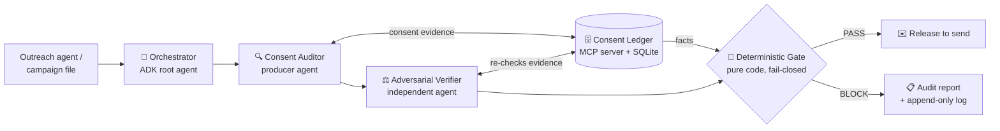

# ConsentGuard 🛑

**The agent that tells other agents "no."**

A fail-closed, multi-agent compliance gate that sits between any AI marketing/outreach agent and the Send button. Before a single message goes out, ConsentGuard verifies — with evidence — that the recipient actually consented on that channel, that the message carries the legally required elements, and that an independent adversarial verifier concurs. No evidence, no send.

> **Kaggle AI Agents Intensive — Capstone. Track: Agents for Business.**

---

## The problem

2026 is the year every business bolted an AI agent onto its outreach: SDR agents, nurture agents, re-engagement agents. They are fast, tireless — and blind. An LLM will happily draft and send 500 "friendly follow-ups" to people who never opted in, on a channel they never consented to, with no unsubscribe link.

That's not a UX bug. It's a legal event:

| Regime | Scope | Max penalty |
|---|---|---|
| **CASL** (Canada) | Every commercial electronic message — email, SMS, DMs | **$10M** per violation (business) |
| **CAN-SPAM** (US) | Commercial email | ~$53k per email |
| **TCPA** (US) | SMS/calls | $500–$1,500 per message |

Everyone is building agents that press Send. Almost nobody is building the agent that says **no**. ConsentGuard is the brakes.

## Why agents (and not just an `if` statement)?

Consent compliance is a *judgment + evidence* problem, not a lookup:

- Consent is **channel-specific** (email consent ≠ SMS consent) and **time-decaying** (CASL implied consent expires: 2 years after a purchase, 6 months after an inquiry).
- Evidence is messy: overlapping records, renewals after withdrawal, form wording that does or doesn't constitute express consent.
- Message content needs semantic review (is the sender identified? is the unsubscribe real or decorative?).
- And auditors make mistakes — so flags themselves need **adversarial review**, both to catch missed violations *and* to overturn false positives (blocking legitimate revenue is also a business cost).

That's a pipeline of specialized agents around a deterministic core — exactly what an agent framework is for.

## Architecture



**The security invariant that makes this trustworthy:** LLM agents *advise*, code *decides*. The final gate is pure Python that re-derives its decision from ledger facts. Agent verdicts can only **tighten** the gate (a verifier-confirmed violation blocks a send even when facts look clean) — they can **never open it** (no agent output can authorize a send that the ledger facts don't support). A prompt-injected or hallucinating agent cannot talk the gate into sending.

### The adjudication loop (producer / verifier)

1. **Consent Auditor** (producer) pulls evidence from the Consent Ledger MCP server for each recipient × channel, classifies the consent basis, and runs message-level checks (sender identity, unsubscribe).
2. **Adversarial Verifier** independently re-pulls the evidence and adjudicates every flag *bidirectionally*: confirm real violations, **reject false positives** (e.g., auditor read a withdrawn 2025 record but missed the 2026 renewed express consent).
3. **Deterministic Gate** takes (ledger facts, message checks, verifier-confirmed violations) and emits PASS/BLOCK per recipient, fail-closed, with plain-English reasons written to an append-only audit log.

### Privacy by architecture

Agents never see raw contact PII. The ledger returns `contact_id` + consent facts; email addresses stay inside the ledger and are only joined back at send time, after the gate. The audit log stores pseudonymous IDs only.

## Course concepts demonstrated

| Concept | Where |
|---|---|
| **Multi-agent system (ADK)** | `app/agent.py` — orchestrator + auditor + verifier (producer/verifier separation) |
| **MCP server** | `mcp_server/consent_ledger.py` — custom Consent Ledger MCP server (stdio), also attachable to Claude/Gemini CLI |
| **Security features** | `app/gate.py` fail-closed deterministic gate; PII minimization; prompt-injection containment (message bodies are data, never instructions; gate ignores agent "permission"); append-only audit log; secrets via `.env` only |
| **Agent skills** | `skills/` — pluggable jurisdiction rule packs (CASL, CAN-SPAM). Swap the pack, same engine |
| **Deployability** | `agents-cli scaffold enhance` → Cloud Run (shown in video) |
| **Antigravity** | Build workflow shown in video |

## Repo layout

```
consentguard/
├── app/
│   ├── agent.py          # ADK multi-agent system (orchestrator, auditor, verifier)
│   ├── gate.py           # deterministic fail-closed gate (pure, unit-tested)
│   └── ledger.py         # SQLite consent ledger (shared by MCP server & in-process tools)
├── mcp_server/
│   └── consent_ledger.py # MCP server exposing the ledger (stdio transport)
├── skills/
│   ├── casl-rule-pack/SKILL.md      # Canada: consent-based regime
│   └── can-spam-rule-pack/SKILL.md  # US email: opt-out regime
├── data/
│   ├── seed_contacts.json    # 8 fictional contacts covering every consent state
│   └── campaign_summer.json  # demo campaign (Driftwood Coffee Roasters — fictional)
├── eval/golden_scenarios.json  # labeled expected outcomes for agents-cli eval
├── tests/test_gate.py          # unit tests for the gate invariants
├── writeup/                    # Kaggle writeup draft + video script
└── PLAN.md                     # 4-day build plan to submission
```

## Quickstart

```bash
cd consentguard
uv sync                          # install deps (google-adk, mcp, pytest)
cp .env.example .env             # add your GOOGLE_API_KEY (never committed)
uv run pytest                    # gate invariants: green before anything else
uv run python -m app.ledger seed # create + seed data/consent_ledger.db
uv run agents-cli playground     # dev UI → run the demo campaign
```

Run the MCP server standalone (e.g., to attach the ledger to Claude Desktop / Gemini CLI):

```bash
uv run python -m mcp_server.consent_ledger
```

## Demo scenario

Fictional **Driftwood Coffee Roasters** queues an 8-recipient summer email promo. ConsentGuard passes 3 and blocks 5 — each with cited evidence:

| Contact | Consent state | Verdict |
|---|---|---|
| c_001 | Express (web form, 2025) | ✅ PASS |
| c_002 | Implied — purchase 6 mo ago (within 2-yr window) | ✅ PASS |
| c_003 | Implied — inquiry 7+ mo ago (**6-mo window expired**) | ⛔ BLOCK |
| c_004 | Withdrawn 2025, **renewed express 2026** — auditor flag overturned by verifier | ✅ PASS |
| c_005 | Unsubscribed last month | ⛔ BLOCK |
| c_006 | No record at all | ⛔ BLOCK (fail-closed) |
| c_007 | Express, but assigned template missing unsubscribe link | ⛔ BLOCK (message-level) |
| c_008 | SMS consent only — campaign is email (**channel mismatch**) | ⛔ BLOCK |

c_004 is the money shot: the producer flags it, the adversarial verifier re-pulls the full ledger history, overturns the false positive, and the gate confirms against facts. Bidirectional adjudication — catching violations *and* protecting legitimate sends.

## Evaluation

`eval/golden_scenarios.json` labels the expected verdict + reason code per contact, and `eval/eval_cases.json` wraps them as an agents-cli dataset. Run with:

```bash
uv run agents-cli eval run --dataset eval/eval_cases.json --metrics FINAL_RESPONSE_MATCH
``` The golden set doubles as a regression map: every real-world edge case we hit becomes a new scenario.

## Roadmap

- GDPR/PECR rule pack (skills are pluggable by design)
- Webhook mode: gate as a pre-send HTTP hook for any CRM/ESP
- Consent-capture helper: generate compliant opt-in form wording and log it as evidence

## Disclaimer

ConsentGuard is a compliance *engineering control*, not legal advice. Rule packs encode a good-faith reading of public statutes; consult a lawyer for your jurisdiction. All contacts and businesses in this repo are fictional.

## License

MIT — see [LICENSE](LICENSE).
